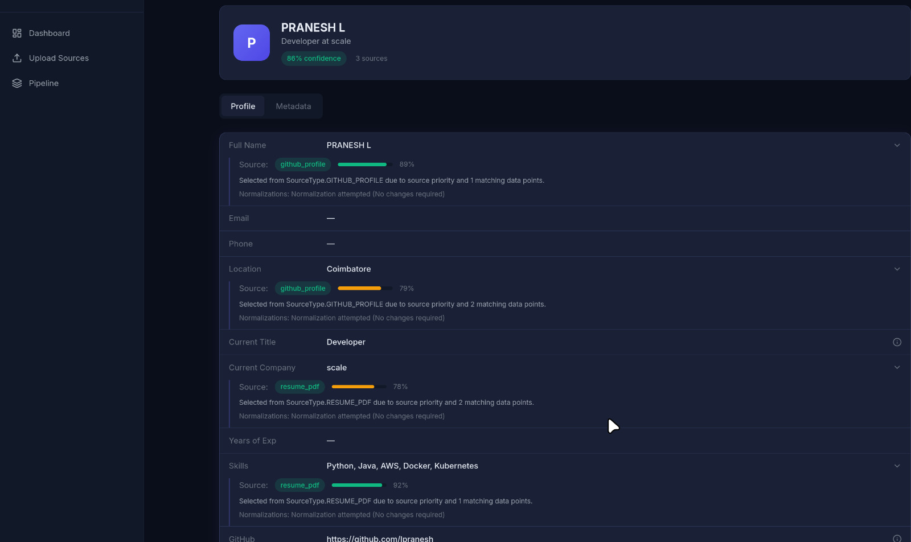
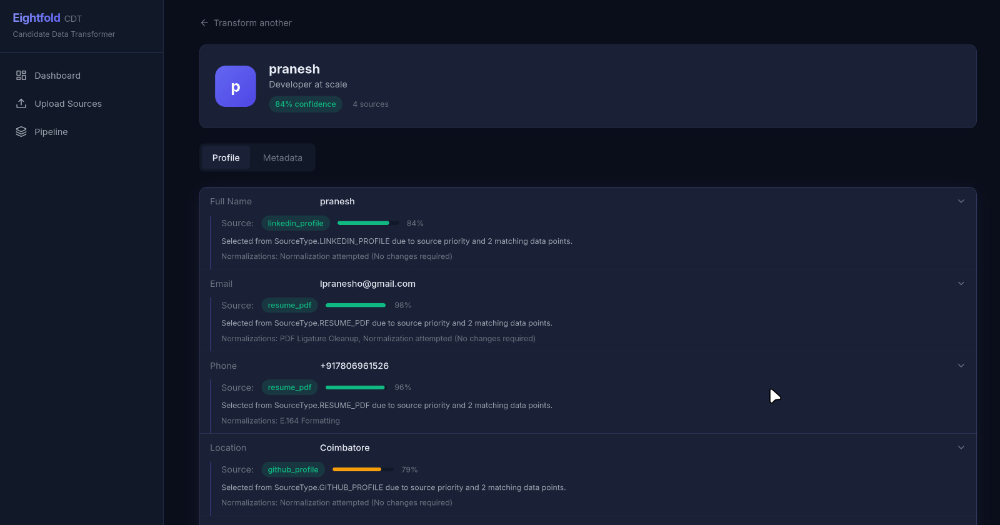
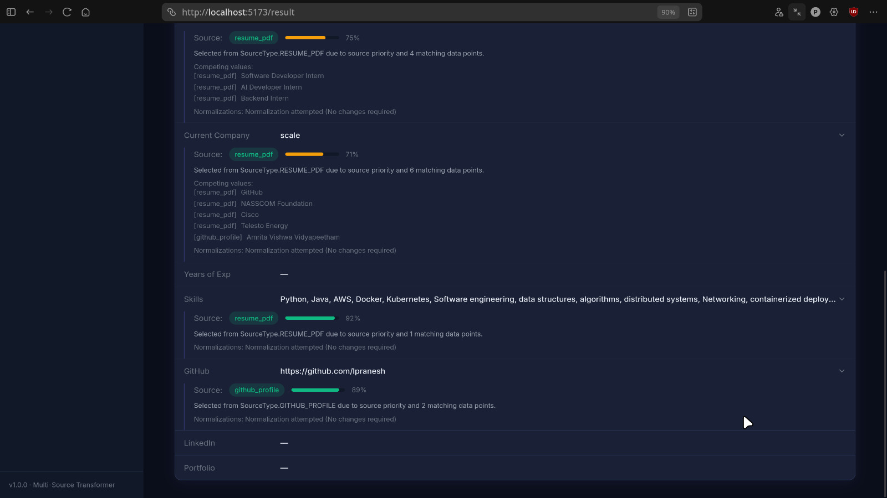

# Candidate Data Transformer

A robust, multi-source pipeline that intelligently fuses disparate candidate data (resumes, LinkedIn, GitHub, recruiter notes) into a unified, canonical profile. This project was built to demonstrate architectural cleanliness, deterministic transformations, and pipeline explainability.

## 🌟 Key Features

*   **Stateless Linear Pipeline**: Employs a linear transformation flow without the overhead of databases, avoiding tight coupling and unnecessary persistence.
*   **Multi-Source Fusion**: Automatically combines data from Recruiter CSVs, Resume PDFs (with OCR fallback), GitHub profiles (via URL), and LinkedIn profiles (via URL).
*   **Explainable Provenance**: Every field in the canonical profile comes with a detailed provenance record, explaining exactly which source was chosen, the extracted values from competing sources, the normalizations applied, and a deterministic confidence score.
*   **Configurable Projections**: Offers robust on-the-fly projection configuration, allowing you to selectively include fields, rename keys, and toggle metadata/provenance directly via the API before returning the response.
*   **Dynamic UI**: A React frontend that immediately surfaces transformation results, complete with a visual confidence breakdown and side-by-side provenance explanations.

## 🏛️ Architecture

The backend implements a clean separation of concerns using emergent design patterns:

1.  **Sources**: Connectors (for fetching URL profiles) and Parsers (for transforming bytes into structured intermediate data). Built around a `ParserFactory` (Factory pattern) and polymorphic `ParserInterfaces` (Strategy pattern).
2.  **Extractors**: Extract structured values from intermediate data. Supports regex and schema-mapping extractors, with a placeholder for future NER integration (e.g. spaCy).
3.  **Processing Layer**:
    *   `Normalizer`: Applies deterministic formatting (e.g., lowercase emails, E.164 phone numbers).
    *   `FusionEngine`: Selects the best field based on a strict priority map (Resume > LinkedIn > GitHub > CSV).
    *   `ConfidenceEngine`: Assigns a deterministic score (0.0 to 1.0) based on source priority, extraction quality, and inter-source agreement.
    *   `ProvenanceBuilder`: Constructs the explanation metadata for the frontend.
    *   `Projector`: A pure function that scopes the final payload based on the user's `ProjectionConfigDTO`.

## 🚀 Getting Started

### Prerequisites
*   Docker & Docker Compose
*   Node.js 22+ (for local frontend)
*   Python 3.12+ (for local backend)
*   [uv](https://github.com/astral-sh/uv) (for local Python dependency management)

### 🐳 Running via Docker (Recommended)

1. Navigate to the root directory.
2. Build and start the containers using Docker Compose:
   ```bash
   sudo docker compose up --build
   ```

**Access the application:**
- **Frontend UI**: http://localhost:5173
- **Backend API**: http://localhost:8000
- **API Docs**: http://localhost:8000/docs

### 💻 Running Locally (Development Mode)

If you prefer to run the application directly on your machine without Docker:

#### 1. Start the Backend
```bash
cd backend
# Install dependencies and sync virtual environment using uv
uv sync
# Activate the virtual environment
source .venv/bin/activate
# Run the FastAPI server
uvicorn main:app --reload --host 0.0.0.0 --port 8000
```

#### 2. Start the Frontend
In a new terminal window:
```bash
cd frontend
# Install dependencies
npm install
# Start the Vite development server
npm run dev
```
The frontend will be available at http://localhost:5173, automatically proxying `/api` requests to your local backend.

### Environment Configuration (`docker-compose.yml` / `.env`)
- `ENABLE_NER`: Toggles the NER extraction phase (`true` | `false`). Defaults to `false`. *(Note: Requires ~700MB model download on first startup if enabled).*
- `OCR_ENGINE`: Configures the PDF fallback extraction engine (default: `tesseract`).

## 📁 Repository Structure

```
backend/
├── app/
│   ├── api/             # FastAPI routes
│   ├── core/            # Configuration and hierarchical exceptions
│   ├── pipeline/        # Single TransformationService orchestrator
│   ├── sources/         # Connectors and Parsers
│   ├── extraction/      # Data extractors (Regex, NER, Structured)
│   ├── processing/      # Normalization, Fusion, Confidence, Projection
│   ├── models/          # Canonical, intermediate, metadata, and DTOs
│   └── interfaces/      # ABCs for Parsers and Extractors
├── Dockerfile           # uv-based Python 3.12 slim-bookworm image
└── main.py              # Application entry point

frontend/
├── src/
│   ├── components/      # UI Layout and shared components
│   ├── pages/           # Upload, Result, and Dashboard views
│   └── lib/             # API client and types
└── Dockerfile           # Node 22 alpine image
```

# Demo of design choices and advantages 

Initially I implemented only Regex extraction.
During testing, I found that Regex works extremely well for deterministic entities like emails, phone numbers and URLs.

Eg :


## After hybrid of NER + Regex




